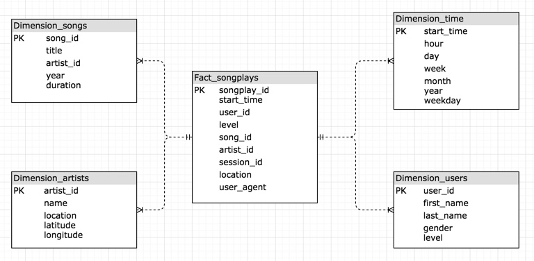

# Data Modeling With PostgreSQL

## Introduction

This is a project for practicing data modeling with PostgreSQL, which is from Udacity's Data Engineering Nanodegree.

This project helps a startup called Sparkify analyzing their data on songs and user activity. By defining a star schema and writing an ETL pipeline, the file based data is transfered into database for later analysis.

## Data Schema and ETL Pipeline

### Data Schema

Sparkify wants to analysis what songs users are listening to. So the star schema focus on the data about playing songs.

- The fact table is songplays which records the data when users play a song. Denormalized by adding reduntant column `artist_id` and `level` in `songplays` table to improve reading performance.
- The dimension tables is users, songs, artists and times.

### ETL Pipeline

The ETL pipeline parse all files of songs and logs, and insert the data into the tables. While inserting, duplicate records for same user_id, song_id, artist_id and start_time would be ignored. For those logs of which no related songs or artists found, no records would be insert into songplays.

## How To Run

### Prerequisite

If you want to run this on your own machine, you should finish the following steps first.

- Install PostgresSQL on localhost.
- Create User `student` with password `student`.
- Create database `studentdb`, and grant all privileges of it to user `student`.

### Instructions

1. Create database/tables: `python create_tables.py`
2. Parse data from files and store it into database: `python etl.py bulk=yes`
3. Check the process result: `python test.py`

## Analysis Example

### Analysis Goals

1. Which is the most popular song in 2018? And who is the song's artist?
2. Who is the most popular artist in 2018? And where is she/he from?
3. Cacluate the average number of songs listened in 2018 for different levels' users?
   - See if paid users would like to spend more time on Sparkify.

### Analysis Results

Execute the `analysis.ipynb` to see the results.

## Project Files

- **data**
  - **log_data**
    - data of users activity
  - **song_data**
    - data of songs
- **images**
  - Document Images
- **analysis.ipynb**
  - A Jupyter Notebook for demo analytic queries.
- **create_tables.py**
  - While executing, this script would
    - `drop` database `sparkifydb`
    - `create` database `sparkifydb`
    - `drop` tables if exists
    - `create` tables if not exists
- **etl.ipynb**
  - A Jupyter Notebook with step-by-step instructions for reading/processing data files and loading the data into tables.
- **etl.py**
  - Complete script to implement the process ETL.
  - While executing, this script would:
    - Iterate all files under data/song_data to parse song/artist data and insert into PostgreSQL database
    - Iterate all files under data/log_data to parse user/time/songplays data and insert into PostgreSQL database.
- **README.md**
  - Description and Instruction about this project.
- **sql_queries.py**
  - In which all DDL statements defined.
  - For INSERT statements, duplicate records would be ignored while inserting.
- **test.ipynb**
  - A Jupyter Notebook searching a few rows of each table to test if the tables' creation and ETL process are successfully implemented.
- **test.py**
  - A Python script to check process results and analytic results.
